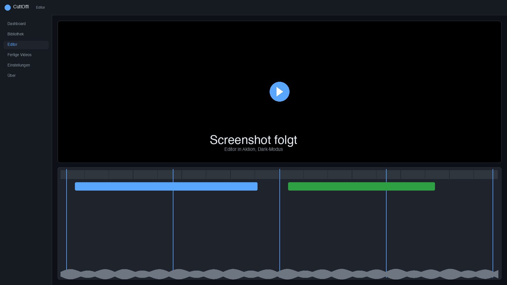
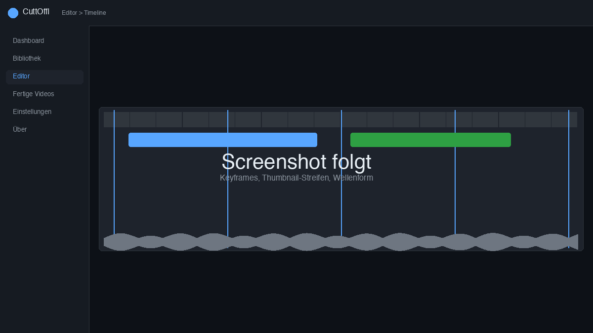
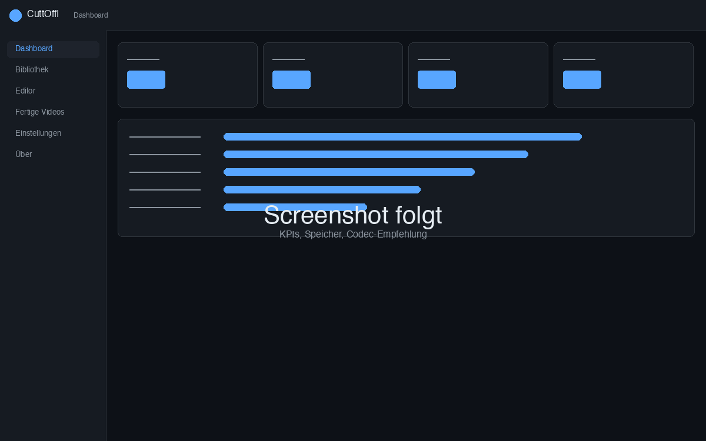
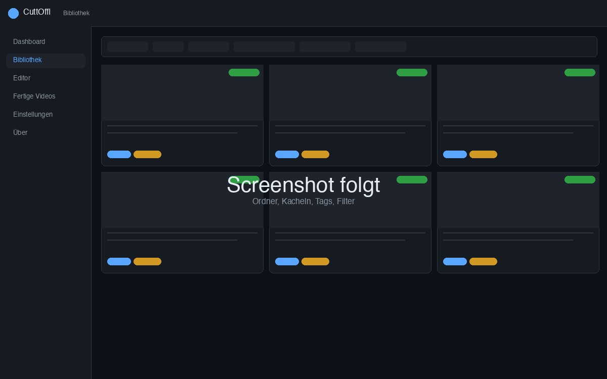
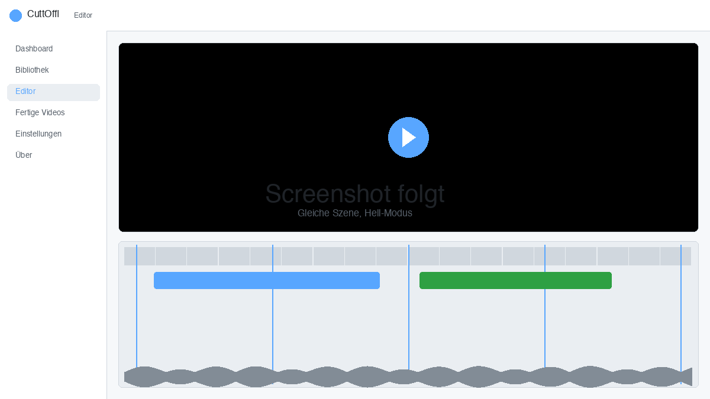

# CuttOffl

Video schneiden -- lokal, ohne Cloud, ohne Konto.

<p align="center">
  
</p>

CuttOffl ist ein Web-Interface fuer FFmpeg, das auf dem eigenen Rechner laeuft.
Du laedst ein Video hoch, schneidest es in einer Timeline mit Keyframes,
Thumbnails und Wellenform, und exportierst das Ergebnis. Die Originaldateien
verlassen den Rechner nicht.

## Das Konzept in einem Absatz

Beim Upload wird ein kleiner **Proxy** (480p) erzeugt -- den laesst sich fluessig
scrubben, auch bei grossen Quellen. Schnitte werden als **EDL** (Edit Decision
List) gespeichert, nicht als neue Datei. Beim Export entscheidet CuttOffl
segmentweise, ob **keyframe-genau ohne Neu-Kodierung** kopiert werden kann
(schnell, verlustfrei) oder ob ein Segment **frame-genau neu kodiert** werden
muss. Hardware-Encoder werden erkannt: VideoToolbox auf dem Mac, V4L2 auf dem
Pi, Software-Fallback sonst.

## Impressionen

<table>
  <tr>
    <td></td>
    <td></td>
  </tr>
  <tr>
    <td align="center"><sub>Editor: Timeline mit Keyframes, Thumbnail-Streifen und Wellenform</sub></td>
    <td align="center"><sub>Dashboard: Speicher-Uebersicht und neueste Videos</sub></td>
  </tr>
  <tr>
    <td></td>
    <td></td>
  </tr>
  <tr>
    <td align="center"><sub>Bibliothek mit Ordnern und Bulk-Aktionen</sub></td>
    <td align="center"><sub>Hellmodus -- alles an UI-Praeferenzen bleibt lokal</sub></td>
  </tr>
</table>

## Was es kann

- Timeline mit Keyframe-Magnet (copy/reencode wird live angezeigt)
- Schneiden per In/Out, Split, Trim-Drag -- Undo/Redo, Auto-Save
- Vorschau fuer Auswahl, einzelne Clips oder die ganze EDL
- Virtuelle Ordner in der Bibliothek, Verschieben per Ordner-Picker
- Hybrid-Render: so viel wie moeglich kopieren, nur noetige Schnitte neu kodieren
- Fertige Videos wieder in die Bibliothek uebernehmen fuer weiteren Schnitt
- Export mit Codec-Empfehlung fuer die erkannte Hardware
- Live-Fortschritt aller Jobs per WebSocket

## Stack

- **Backend:** FastAPI, SQLite via `aiosqlite`, natives SQL
- **Frontend:** Svelte 5 (Runes) + Vite 8 + Tailwind 4, kein SvelteKit
- **Rendering:** FFmpeg mit Concat-Demuxer
- **Hardware:** VideoToolbox (Mac), V4L2 (Pi), libx264-Fallback

## Voraussetzungen

- macOS (Apple Silicon empfohlen) oder Linux inkl. Raspberry Pi 5
- Python 3.11+, Node.js 20+
- FFmpeg 6+ im `PATH` (`brew install ffmpeg` bzw. `apt install ffmpeg`)

## Installation & Start

```bash
./setup.sh                  # backend venv + pip install + ffmpeg-Check
cd frontend && npm install  # frontend deps
cd ..
./start.sh                  # startet beide Prozesse
```

Weitere Befehle: `status`, `logs`, `stop`, `restart`, `backend`, `frontend`.

- Frontend: <http://127.0.0.1:10037>
- Backend: <http://127.0.0.1:10036/docs>

Logs unter `logs/backend.log` und `logs/frontend.log`, PIDs in `logs/*.pid`.

## Ports

| Port  | Dienst           |
|-------|------------------|
| 10036 | Backend (FastAPI) |
| 10037 | Frontend (Vite)   |
| 10038 | Reserve           |

## API-Uebersicht

Vollstaendig interaktiv in Swagger unter `/docs`. Die wichtigsten Pfade:

| Methode | Endpunkt                                  | Zweck                          |
|---------|-------------------------------------------|--------------------------------|
| POST    | `/api/upload`                             | Video hochladen                |
| GET     | `/api/files`                              | Originale listen               |
| GET     | `/api/proxy/{id}`                         | Proxy-Stream (Range-Support)   |
| GET     | `/api/proxy/{id}/keyframes`               | Keyframe-Zeitstempel           |
| GET     | `/api/sprite/{id}` / `/meta`              | Timeline-Tile-JPEG             |
| GET     | `/api/waveform/{id}`                      | Audio-Peaks                    |
| GET/POST/PUT/DELETE | `/api/projects`                 | EDL-Projekte                   |
| POST    | `/api/projects/{id}/render`               | Render-Job starten             |
| GET     | `/api/exports`                            | Fertige Renderings             |
| POST    | `/api/exports/{id}/import-to-library`     | Export als neue Quelle         |
| WS      | `/ws/jobs`                                | Live-Fortschritt aller Jobs    |

## Verzeichnisse

```
CuttOffl/
├── backend/app/          FastAPI, Services, Router, Schemas
├── frontend/src/         Svelte-App (Views, Components, lib)
├── data/                 originals, proxies, exports, thumbs, sprites,
│                         waveforms, tmp, db
├── docs/screenshots/     Screenshots fuer diese README
├── logs/                 Laufzeit-Logs + PIDs
├── setup.sh
└── start.sh
```

## Lizenz

Nicht-kommerzielle Lizenz v2.0 (`LicenseRef-CuttOffl-NC-2.0`), basierend auf
[CC BY-NC-ND 4.0](https://creativecommons.org/licenses/by-nc-nd/4.0/legalcode.de)
mit Ergaenzungen. Copyright 2026 HalloWelt42. Private Nutzung erlaubt,
kommerzielle Nutzung und Veroeffentlichung modifizierter Versionen nicht.
Vollstaendig in [`LICENSE`](LICENSE) und in der App unter **Ueber**.

## Unterstuetzung

Wenn es nuetzlich ist und du die Weiterentwicklung unterstuetzen moechtest:

- **Ko-fi:** <https://ko-fi.com/HalloWelt42>
- **Bitcoin:** `bc1qnd599khdkv3v3npmj9ufxzf6h4fzanny2acwqr`
- **Dogecoin:** `DL7tuiYCqm3xQjMDXChdxeQxqUGMACn1ZV`
- **Ethereum:** `0x8A28fc47bFFFA03C8f685fa0836E2dBe1CA14F27`

Der Spenden-Dialog in der App (Button **Danke** in der Seitenleiste) zeigt
QR-Codes. Projekt-Infos stehen auf der Seite **Ueber**.
